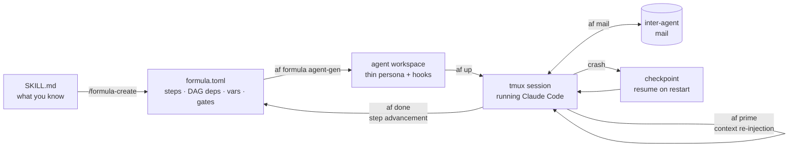

# agentfactory — multi-agent orchestration for Claude Code

**Turn your `SKILL.md` files into an autonomous agent workforce.** agentfactory is a
multi-agent orchestration CLI that runs Claude Code agents through declarative TOML
workflows — with crash recovery, context re-injection, and inter-agent mail built in.

[](https://github.com/stempeck/agentfactory/actions/workflows/test.yml)
[](go.mod)
[](LICENSE)
[](https://github.com/stempeck/agentfactory/releases)

## Why agentfactory

Long-running LLM agents fail in predictable ways. Give an agent a list of steps and at some
point it will improvise — skip a step, substitute a heuristic, and keep going. Recency bias
means whatever entered the context last dominates what the agent does next. When the context
window fills and gets compressed, the agent quietly loses its identity, its place in the
workflow, or both. And when a session crashes mid-task, there is usually nothing to recover:
the plan lived inside the conversation.

Skills (`SKILL.md` files) capture *what you know*, but a skill alone can't hold an agent to a
workflow — the agent needs a harness. agentfactory separates the two concerns: **personas**
stay thin (identity, startup protocol, available commands), while **workflows live in
formulas** — declarative TOML files with steps, DAG dependencies, variables, and quality
gates. The `af` runtime bridges them: it instantiates a formula into trackable work items,
re-injects identity and the current step on every prompt (surviving context compression),
checkpoints progress so a crashed agent resumes where it stopped, and gives agents a mail
system to coordinate multi-agent work.

## Architecture



Three layers:

1. **Agent templates** (`.md.tmpl`) — thin persona shells: identity, startup protocol, commands
2. **Formulas** (`.formula.toml`) — declarative workflows: steps, DAG dependencies, variables, gates
3. **`af` runtime** — instantiates formulas as work items, injects context via `af prime`, tracks progress via `af done`

Agents don't need to know their full workflow. They run `af prime` to get the current step,
execute it, run `af done` to advance, and repeat. On context compression, `af prime`
re-injects identity and step context automatically. Deeper reading:
[formulas reference](docs/formulas.md) · [agent lifecycle](docs/agent-lifecycle.md) ·
[recovery model](docs/recovery-model.md) · [architecture corpus](docs/architecture/overview.md).

## How it compares

| | Workflow definition | Execution substrate | Crash / context-loss recovery |
|---|---|---|---|
| **agentfactory** | Declarative TOML DAGs, separate from personas | Claude Code sessions in tmux — inspectable, attachable | First-class: checkpoints + `af prime` re-injection |
| **LangGraph** | Graphs built in Python/JS application code | Your app process calling model APIs | Checkpointing available; you build the harness |
| **CrewAI** | Role/task definitions in Python code | Your app process calling model APIs | Not a core concern; retries at task level |
| **Claude Code subagents** | Prompts inside one session | In-session fan-out | None — subagent state dies with the session |

Honest scope: agentfactory orchestrates **Claude Code** specifically — it is not a
model-agnostic framework. If you want programmatic graphs inside a Python app, LangGraph is
the better fit. If you live in Claude Code and want autonomous, restartable, coordinated
agents driven by workflows you can diff and review, that's what this is for.

## Quick Start

### Prerequisites

- Go 1.24+
- Python 3.12
- Node.js 18+
- tmux 3.0+
- jq
- git 2.20+
- GitHub CLI (`gh`)
- Docker (optional, for containerized setup)

### Installation

#### From Source

```bash
git clone https://github.com/stempeck/agentfactory.git
cd agentfactory
make build
make install    # installs af to ~/.local/bin
```

Verify: `af version`

#### Using Docker

```bash
git clone https://github.com/stempeck/agentfactory.git
cd agentfactory
./quickdocker.sh <github-repo-path>
```

This builds a container with all prerequisites, clones your target repo, and runs
`quickstart.sh` inside it. When it finishes, the container is ready for `af up`.

A clean install now also **reveals the web console before the shell**: when it finishes it
prints the loopback URL `http://127.0.0.1:<HOSTPORT>/` (and opens your browser on macOS)
immediately before dropping you into the interactive shell — so you no longer have to run
`--web` yourself just to first see it. Use `--web` only to **re-open** the console later. See
the **Web Console (optional)** section below and [`web/README.md`](web/README.md) for details.

#### Using quickstart.sh (inside the docker container @ docker exec -it -u dev "af_ghusername_repo" bash)

```bash
cd ~/projects/agentfactory/
./quickstart.sh           # full setup — installs af, Claude Code, configures workspace
```

### Authenticate Claude Code

After installation, run `claude` once to authenticate. Agents require an authenticated Claude
Code session to function.

## Usage

### 1. Initialize a factory in your project (unnecessary if you run quickstart.sh)

Every repository gets its own factory. Run from your project root:

```bash
cd ~/src/myproject
af install --init
af install manager
af install supervisor
```

`af install --init` automatically excludes factory directories from git via
`.git/info/exclude` — no `.gitignore` changes needed.

### 2. Start agents

```bash
af up manager           # launch manager in a tmux session
af attach manager       # attach to interact with it
```

Or start the supervisor for autonomous work:

```bash
af up supervisor        # runs independently, picks up mail
```

### 3. Dispatch work to agents (the REAL value)

From any context:

```bash
af sling --agent supervisor "Fix the auth bug in login.go"
```

Or talk to the manager directly after attaching:

```bash
af attach manager
# now you're in the manager's Claude session — just talk to it
```

The manager can sling agents or delegate to agents via mail:

```bash
af mail send supervisor -s "Fix auth bug" -m "The login handler in login.go is not checking token expiry."
```

## Creating Custom Agents from Skills (the REAL value)

This is the core workflow: turn a SKILL.md into an autonomous agent.

### 1. Create a formula from your skill

```bash
claude
/formula-create "/path/to/your/SKILL.md"
# e.g. ./.claude/skills/rapid-implement/SKILL.md")
```

This generates a `.formula.toml` file in `.agentfactory/store/formulas/`. Be patient. It can
take some time.

NOTICE: `.claude/skills/rapid-implement/SKILL.md` was provided in case you want to try
creating your first coding agent.

### 2. Generate an agent from your formula (your-agent-name.formula.toml -> your-agent-name)

```bash
af formula agent-gen your-agent-name
```

This creates the agent's workspace, CLAUDE.md template, hook configuration, and registers it
in `agents.json`.

### 3. Rebuild af with the new agent template

```bash
make install
```

Required because `af prime` reads templates from the compiled binary (`go:embed`). Without
this, the agent falls back to the generic supervisor template on context compression.

### 4. Start the agent

```bash
af up your-agent-name
```

Or dispatch work to it directly:

```bash
af sling --agent your-agent-name "do the thing"
```

### Batch regeneration

To regenerate all specialist agents from formulas and re-bootstrap the factory, run the
redeploy command from the main project checkout:

```bash
af install --agents          # regenerate all + rebuild, then bootstrap
af up                        # agents are stopped during regen — restart them
```

See `USING_AGENTFACTORY.md` for preconditions, data-safety, and `--no-build` notes.

## Included Formulas

Nineteen formulas ship with the factory (see [docs/formulas.md](docs/formulas.md) for the format):

| Family | Formulas | Purpose |
|---------|----------|---------|
| Implementation | `rapid-implement`, `rapid-increment`, `fable-implement`, `fable-increment` | Structured feature implementation with quality gates |
| Design | `design`, `design-v3`, `design-v7`, `design-plan-impl`, `rapid-soldesign-plan`, `web-design` | Design exploration with constraint verification |
| Review | `mergepatrol`, `ultra-review`, `fable-review` | PR review, merge workflow, deep multi-pass review |
| Root cause | `rootcause-all`, `investigate` | Failure investigation and verified root-cause analysis |
| Utility | `factoryworker`, `minimalworker`, `gherkin-breakdown`, `github-issue` | General workers, scenario breakdown, issue authoring |

## Included Skills

| Skill | Purpose |
|-------|---------|
| `/formula-create` | Create a formula TOML from a SKILL.md |
| `/github-issue` | Create well-documented GitHub issues from current (or specified) context |
| `/documentation-update` | Audit and update a documentation file (.md) against the codebase |

## Web Console (optional)

Agentfactory ships an **optional** web console for managing the factory (the Floor view, slinging
tasks, dispatch status, settings, and design prototypes). It is a separate Go module under `web/`
and is **not** required to run `af`.

**Build and install (best-effort):**

```bash
make build-webui          # builds ./web/cmd/afweb -> ./webui at the repo root
make install              # installs af and, if present, copies webui to ~/.local/bin/webui
```

Inside the container, `quickstart.sh` launches the console **iff** the `webui` binary is present
(`$HOME/.local/bin/webui`) and stays silent when it is absent — the factory bootstrap never depends
on it. A second launch finds the already-running server (via its `.runtime/webui_server.json`
rendezvous + start-lock) and no-ops, so relaunching is safe.

### Remote access — loopback-only (do NOT publish the port)

The console binds **loopback only** (`127.0.0.1`). This is deliberate and load-bearing: the control
plane can stop/sling agents and edit config, so an exposed socket is a remote-code-execution and
irreversible-loss risk (cross-review **CR-1**).

**Do not** publish the port. The container is started **without** `-p`/`--publish`
(`quickdocker.sh`/`Dockerfile` never expose it), and that must stay true — adding `-p` turns an
unauthenticated loopback control plane into an open one.

**Standard path — `quickdocker.sh <repo> --web`.** When your laptop is also the docker host, just run:

```bash
quickdocker.sh user/myrepo --web    # -> 🔗 Open your factory:  http://127.0.0.1:<HOSTPORT>/
```

This stands up a detached, idempotent, `127.0.0.1`-only bridge to the console's in-container loopback
and prints a clickable URL — no SSH, no reading port files, no container rebuild. The full operator
runbook (access, `--shell`, prerequisites, multiple factories, restart, security, troubleshooting) is
[`web/README.md`](web/README.md).

**Alternative — operator SSH local-forward (headless / remote docker hosts).** When the docker host is
*not* your workstation (a remote or headless server, where the `--web` bridge cannot reach a local
browser), reach the console with an operator **SSH local-forward**, which keeps the socket on loopback
at both ends:

```bash
# Find the console's port from inside the container (printed at startup, or read the rendezvous file):
cat .runtime/webui_server.json     # -> {"transport":"tcp","address":"127.0.0.1:PORT",...}

# From your workstation, forward a local port to the container's loopback console port:
ssh -L 127.0.0.1:8888:127.0.0.1:PORT user@host
# then open http://127.0.0.1:8888/ in your browser
```

When the bind is ever non-loopback (not the default), the console additionally requires a
session token (printed at startup) as defense-in-depth — but that is **not** a license to publish
the port; the socket stays loopback whether you reach it via the `--web` bridge or the SSH forward.

## Key directories

```
.agentfactory/
  factory.json              # root marker
  agents.json               # agent registry
  messaging.json            # mail groups
  agents/<name>/            # per-agent workspace
    CLAUDE.md               # role template
    .claude/settings.json   # hooks
.agentfactory/store/
  formulas/                 # formula TOML files
.agentfactory/hooks/                      # quality/fidelity gate scripts
```

## Command Reference

### Agent lifecycle

```bash
af up [agents...]                  # start agent tmux sessions
af down [agents...] [--all]        # stop sessions
af attach <agent>                  # attach to a running session
af install --init                  # initialize factory
af install <role>                  # provision an agent
```

### Messaging

```bash
af mail send <to> -s <subj> -m <msg>   # send mail
af mail send @all -s <subj> -m <msg>   # broadcast
af mail inbox                           # list unread
af mail read <id>                       # read message
af mail reply <id> -m <msg>             # reply
```

### Agent & Formula execution

```bash
af sling --agent <name> "task"                            # dispatch task (common/simple use)
af formula agent-gen <name>                               # generate your own specialist agent
af sling --formula <name> --var key=val --agent <agent>   # instantiate formula (uncommon/complex use)
af prime                                                  # inject identity, get next step instruction (used by agents)
af done                                                   # complete and advance to next step (used by agents)
```

## Roadmap

- **Prebuilt release binaries** (GoReleaser) so `af` installs without a Go toolchain
- **Richer shipped formula library** — more turnkey specialist agents out of the box
- **Gate quality improvements** — reduce fidelity-gate false positives on passive steps ([#75](https://github.com/stempeck/agentfactory/issues/75))
- **Default dispatch workflow** included with the factory ([#73](https://github.com/stempeck/agentfactory/issues/73))
- **Web console growth** — deeper agent detail, formula authoring in the browser

Have a use case these don't cover? [Open an issue](https://github.com/stempeck/agentfactory/issues/new/choose).

## Contributing

Contributions are welcome — see [CONTRIBUTING.md](CONTRIBUTING.md) for guidelines, CLA
requirements, and development setup. Good entry points are labeled
[good first issue](https://github.com/stempeck/agentfactory/issues?q=is%3Aissue+is%3Aopen+label%3A%22good+first+issue%22).

## License

AGPL-3.0. See [CONTRIBUTING.md](CONTRIBUTING.md) for commercial licensing inquiries.

### Disclaimer

The contributors to this project take no responsibility for your agent (or their respective
LLMs) actions.

---

Built and maintained by **[Glenn Stempeck](https://github.com/stempeck)** ·
[LinkedIn](https://www.linkedin.com/in/glenn-stempeck/) ·
[Medium](https://medium.com/@glennstempeck)

Good luck, and enjoy your Factory of Agents!
