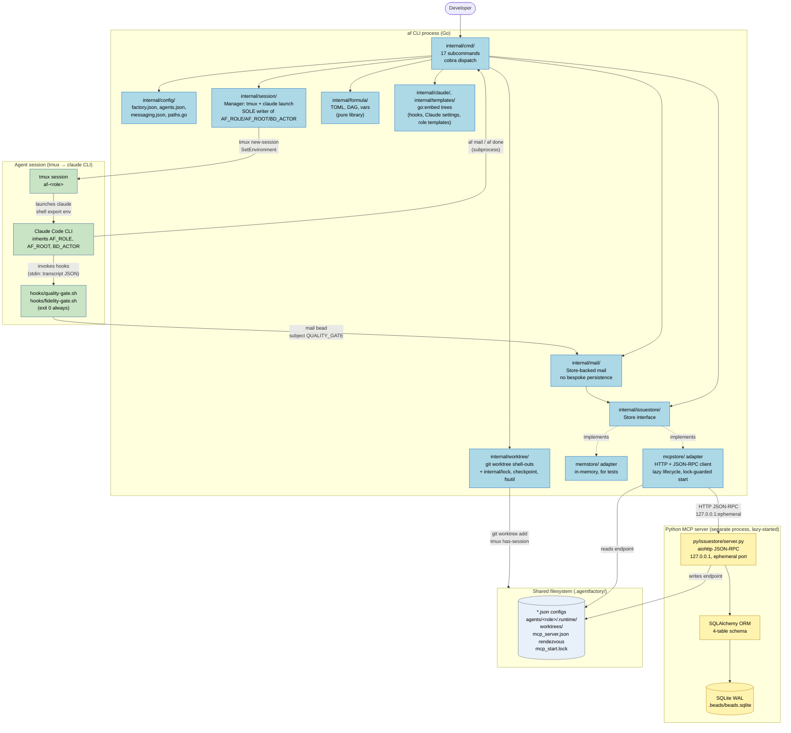

# Containers (C4 L2)

Zooms inside the `af` box from `overview.md`. Every container here is a
runtime process or a persistent store; every arrow is a real wire
protocol, a subprocess boundary, or a filesystem-shared contract.

---

## Container diagram

---

## Container inventory

| Container | Type | Lifetime | Anchors |
|-----------|------|----------|---------|
| `af` CLI | Go process | Per invocation | `cmd/af/main.go` |
| Python MCP server | Python 3.12 process | Lazy-started, persists across invocations; SIGTERM-clean | `py/issuestore/server.py`, `internal/issuestore/mcpstore/lifecycle.go` |
| Agent session | tmux session hosting a `claude` child | User-lifetime (until `af down`) | `internal/session/session.go` |
| SQLite database | WAL-mode file | Persistent | `.agentfactory/.beads/beads.sqlite` |
| Embedded asset trees | Compiled into `af` binary | Binary-lifetime | `internal/claude/`, `internal/templates/` |

---

## Cross-container contracts (seams)

Detail in `seams.md`; summary:

1. **`issuestore.Store`** interface — `internal/issuestore/store.go`; two
   adapters; package-var seam at `internal/cmd/helpers.go:17-24`.
2. **JSON-RPC over loopback HTTP** — 9 `issuestore_*` tool names;
   endpoint file rendezvous under `.runtime/mcp_server.json`;
   startup serialized by `.runtime/mcp_start.lock`.
3. **tmux subprocess** — `tmux has-session`, `tmux new-session`,
   `tmux attach-session`; `af-` prefix owned by
   `internal/session/names.go`.
4. **git worktree subprocess** — `worktree.go:114, 233, 246, 100`.
5. **Claude Code settings + hooks** — source of truth is
   `internal/claude/config/*.json` and `hooks/*.sh`; mirrored to
   `internal/cmd/install_hooks/`; drift test at
   `internal/cmd/install_hooks_drift_test.go` (**INV-8**).
6. **Self-invoked `af`** — `done.go:262` (WORK_DONE mail),
   `prime.go:334` (mail check); the subprocess boundary is unexplained
   (`gaps.md`).

---

## Trust boundaries visible here

| From → To | Trust model | Anchor |
|-----------|-------------|--------|
| User → `af` | Unix process permissions | N/A |
| `af` → Python MCP | Same-user, loopback bind, no auth (`R-SEC-1`, `INV-4`) | `py/issuestore/server.py:267-268`, `internal/issuestore/mcpstore/mcpstore.go:7` |
| `af` → tmux | Same-user subprocess | `internal/tmux/tmux.go` |
| `session.Manager` → agent session env | Sole writer of identity | `internal/session/session.go:116, 159` |
| Agent's Claude → hooks | stdin JSON + inherited env; hooks `exit 0` (enforcement via mail) | `subsystems/hooks.md` |

---

## Why two processes instead of one?

Covered in [ADR-001](adrs/ADR-001-mcp-over-sqlite.md). Short version: the
MCP server replaced a previous `bd` CLI shell-out and was chosen over a
direct SQLite library so future backend swaps and multi-language clients
can speak the same JSON-RPC surface. The cost is a lazy-start lifecycle
+ endpoint rendezvous, both non-trivial — see
`subsystems/py-issuestore.md` and `history.md#theme-1`.
