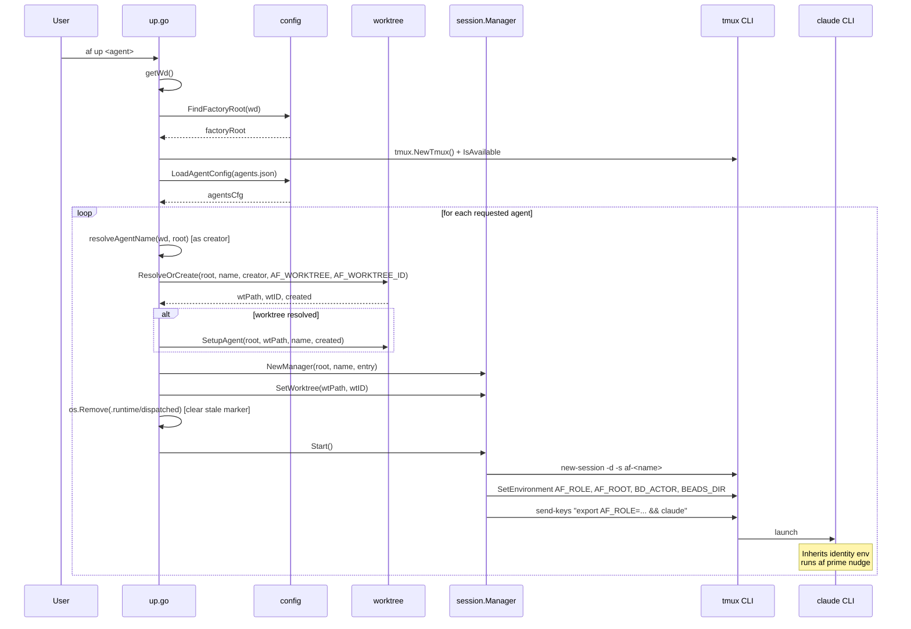

# Flow: `af up <agent>`

Starts a tmux session for one or more agents, ensuring each has a
worktree and is launched with the correct identity env.

**Entry point:** `internal/cmd/up.go:runUp`.

---

## Sequence

---

## Call-site anchors

| Step | File:line |
|------|-----------|
| Enter | `internal/cmd/up.go:runUp` (start of file) |
| `getWd()` | `up.go:28` |
| `config.FindFactoryRoot` | `up.go:33` |
| tmux availability check | `up.go:38-41` |
| `LoadAgentConfig` | `up.go:43-44` |
| Read `AF_WORKTREE`, `AF_WORKTREE_ID` | `up.go:66-67` |
| `resolveAgentName` (creator) | `up.go:68`, definition `internal/cmd/helpers.go:55-102` |
| `worktree.ResolveOrCreate` | `up.go:69` |
| `worktree.SetupAgent` | `up.go:75` |
| `session.NewManager` | `up.go:83` |
| `mgr.SetWorktree` | `up.go:85` |
| Clear `.runtime/dispatched` | `up.go:91, 93` |
| `mgr.Start()` | `up.go:95` |
| Env export in claude-launch keys | `internal/session/session.go:159` |
| tmux `SetEnvironment` | `internal/session/session.go:116` |

---

## Invariants active in this flow

- **INV-2** — no user-facing identity override: `af up <agent>`'s only
  input is the agent name, which is validated against `agents.json`
  membership.
- **INV-3** — library layer reads no env; `AF_WORKTREE` /
  `AF_WORKTREE_ID` are read in the cmd layer (`up.go:66-67`) and passed
  into `worktree.ResolveOrCreate` as parameters.
- **Trust anchor** — `session.Manager` is the sole writer of
  `AF_ROLE`, `AF_ROOT`, `BD_ACTOR`, `BEADS_DIR`
  (`trust-boundaries.md`, `session.go:116, 159`).
- **Idiom** — three-tier identity resolution via `resolveAgentName`
  (`idioms.md#2`): cwd → `agents.json` membership → `AF_ROLE` fallback.

---

## Failure modes

| Condition | Where handled |
|-----------|---------------|
| tmux not installed | `up.go:38-41` — early return |
| Agent not in `agents.json` | `LoadAgentConfig` + entry lookup in `Start` |
| Worktree resolution fails | warned; continues without worktree (reduces dispatch capability) |
| Session already exists | `mgr.Start()` returns `session.ErrAlreadyRunning`; caller prints "already running" |
