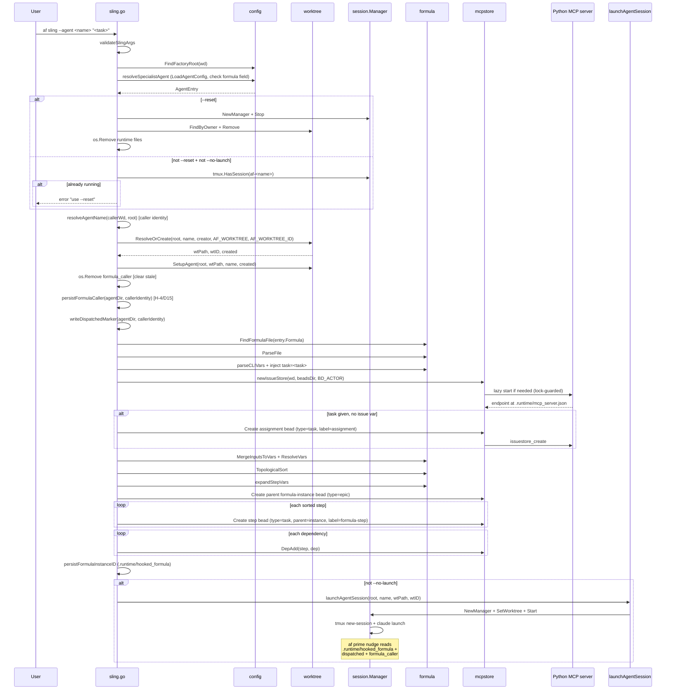

# Flow: `af sling --agent <specialist> "<task>"` (specialist dispatch)

Dispatches work to a specialist agent by instantiating the agent's
formula, creating bead DAG, persisting caller identity for WORK_DONE
routing, and launching the session.

**Entry point:** `internal/cmd/sling.go:runSling` → `dispatchToSpecialist`.

---

## Sequence

---

## Call-site anchors

| Step | File:line |
|------|-----------|
| Entry | `internal/cmd/sling.go:runSling` (line 71) |
| `validateSlingArgs` | `sling.go:96-107` |
| `config.FindFactoryRoot` | `sling.go:81` |
| Dispatch branch | `sling.go:88` → `dispatchToSpecialist` (line 114) |
| `resolveSpecialistAgent` | `sling.go:221-238` |
| `--reset` handling (Stop, FindByOwner, Remove, runtime cleanup) | `sling.go:125-147` |
| Already-running pre-flight | `sling.go:148-156` |
| Worktree resolution | `sling.go:159-177` |
| Stale `formula_caller` clear | `sling.go:183` |
| `persistFormulaCaller` (H-4/D15 ordering invariant) | `sling.go:591-599` |
| `writeDispatchedMarker` | `sling.go:191, 667-671` |
| `instantiateFormulaWorkflow` | `sling.go:299-435` |
| Auto-create assignment bead | `sling.go:343-355` |
| `persistFormulaInstanceID` | `sling.go:544-548` |
| `launchAgentSession` (package-var seam) | `sling.go:216`, definition at `sling.go:616-650` |

---

## Invariants active in this flow

- **H-4 / D15 atomic-write ordering** — `persistFormulaCaller`
  runs BEFORE `instantiateFormulaWorkflow` creates the formula bead, so
  `af done` never sees a formula bead without a caller file
  (`sling.go:579-590` docstring; pinned by
  `TestDone_NoCallerFile_NoMail`).
- **Idiom #1 — `IncludeAllAgents: true` opt-out** — step beads are
  created with no `Assignee`; downstream `af done` MUST use
  `IncludeAllAgents: true` to see them (see `done.go:97-101, 133-137`
  and the WORK_DONE flow).
- **Idiom #9 — package-var seam** — `launchAgentSession` is a `var`
  so tests swap it with a no-op to avoid blocking on claude readiness
  (`sling.go:607-615` docstring).
- **INV-3** — library layer reads no env; `BD_ACTOR` is read by the
  cmd layer (`sling.go:336`) and injected into the mcpstore constructor.

---

## State written to `.runtime/`

| File | Writer | Purpose | Anchor |
|------|--------|---------|--------|
| `.runtime/formula_caller` | `persistFormulaCaller` | WORK_DONE recipient | `sling.go:591-599` |
| `.runtime/dispatched` | `writeDispatchedMarker` | Marks session for auto-terminate on completion | `sling.go:667-671` |
| `.runtime/hooked_formula` | `persistFormulaInstanceID` | Active formula instance bead ID for `af prime` / `af done` | `sling.go:544-548` |
| `.runtime/worktree_id`, `worktree_owner` | `worktree.SetupAgent` | Worktree cleanup coordination in `af done` | `worktree.SetupAgent` |
