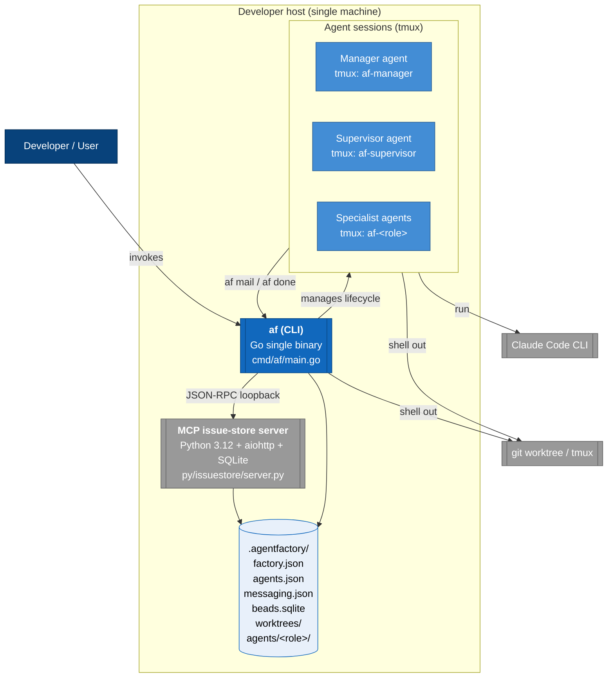

# Architecture overview (C4 L1 — System context)

Entry point for readers who want the shape of the system before the
citations. Every claim here is backed by detail in the corpus
(`idioms.md`, `invariants.md`, `subsystems/*.md`); this page is the
index, not the source.

---

## What agentfactory is

agentfactory is a single-binary CLI (`af`) that orchestrates multiple
Claude Code agents on one developer machine. Each agent runs inside a
tmux session under a role-specific working directory (manager,
supervisor, specialist, etc.). The agents coordinate via a shared bead
store (issues with DAG dependencies) and an inter-agent mail system
layered on top of the same store.

The binary is installed into a **factory root** (a directory containing
`.agentfactory/`) and uses that root as the single source of truth for
configuration, identity, and the bead store.

---

## System context diagram (C4 L1)



---

## Trust and identity, in one picture

Identity (`AF_ROLE`, `AF_ROOT`, `BD_ACTOR`) is **set by
`session.Manager` only** — one writer, many readers. The library layer
(`internal/issuestore`, `internal/formula`, `internal/config`) is
forbidden from reading env vars; context is plumbed through
constructors. Full detail: `trust-boundaries.md`.

```
[user CLI invocation]
    │
    ▼
[session.Manager]  ← SOLE writer of AF_ROLE / AF_ROOT / BD_ACTOR / BEADS_DIR
    │             session.go:116, 159
    ▼
[cmd layer]        ← reads env, validates against agents.json (resolveAgentName)
    │             helpers.go:55-102
    ▼
[library layer]    ← MUST NOT read env (INV-3)
    │
    ▼
[mcpstore adapter] ← injects actor filter at mcpstore.go:199-214
    │
    ▼
[Python MCP server, 127.0.0.1 loopback, no auth]
```

Forbidden: user-facing identity overrides (`--as`, `--actor`, `--from`)
— **INV-2**, `feedback_no_agent_overrides.md`, and the reason commit
`63307bb` was deleted rather than archived.

---

## Where to read next

| If you want... | Read |
|----------------|------|
| The containers and their ports | `containers.md` (C4 L2) |
| What happens when I run `af up <agent>` | `flows/af-up.md` |
| What happens when I dispatch work (`af sling --agent`) | `flows/formula-instantiation.md` |
| What happens when an agent finishes (`af done`) | `flows/work-done-cascade.md` |
| The decisions behind the shape | `adrs/README.md` (ADR index) |
| The patterns every cross-cutting change touches | `idioms.md` |
| The invariants every change MUST preserve | `invariants.md` |
| Cross-subsystem contracts in detail | `seams.md` |
| Per-subsystem shape, seams, formative commits | `subsystems/*.md` |
| Known drift, gaps, `"unknown — needs review"` | `gaps.md` |
| Architectural timeline | `history.md` |

---

## Primary subsystems at a glance

| Subsystem | Purpose | Detail |
|-----------|---------|--------|
| `internal/cmd/` | 17 cobra subcommands; identity resolver; package-var seams | `subsystems/cmd.md` |
| `internal/session/` + `internal/tmux/` | Agent session runtime; sole writer of identity env vars | `subsystems/session.md` |
| `internal/issuestore/` (+ `mcpstore/`, `memstore/`) | Store interface; adapters for production and tests | `subsystems/issuestore.md` |
| `py/issuestore/` | Python MCP server: aiohttp + SQLAlchemy + SQLite | `subsystems/py-issuestore.md` |
| `internal/config/` | factory.json / agents.json / messaging.json / paths | `subsystems/config.md` |
| `internal/formula/` | TOML parsing, DAG, variable resolution | `subsystems/formula.md` |
| `internal/mail/` | Store-backed inter-agent mail | `subsystems/mail.md` |
| `internal/worktree/` + `lock/` + `checkpoint/` + `fsutil/` | Filesystem primitives | `subsystems/fs-primitives.md` |
| `internal/claude/` + `internal/templates/` | `go:embed` trees for Claude settings and role CLAUDE.md | `subsystems/embedded-assets.md` |
| `hooks/` | Quality + fidelity gates (mirrored into binary) | `subsystems/hooks.md` |

---

## Key decisions at a glance

Each row links to an ADR; the ADR links back to the corpus anchor.

| Decision | ADR |
|----------|-----|
| Use an MCP server (not a direct SQLite library) for the issue store | [ADR-001](adrs/ADR-001-mcp-over-sqlite.md) |
| Opt out of actor-scoping with `IncludeAllAgents: true`, not an adapter-seam bypass | [ADR-002](adrs/ADR-002-includeallagents-idiom.md) |
| No user-facing identity overrides (`--as`, `--actor`) | [ADR-003](adrs/ADR-003-no-identity-overrides.md) |
| Library layer reads no env vars | [ADR-004](adrs/ADR-004-library-env-hermeticity.md) |
| Runtime precondition, not type-level interlock, for worktree ownership | [ADR-005](adrs/ADR-005-runtime-precondition-over-types.md) |
| Python MCP server binds loopback only, no auth | [ADR-006](adrs/ADR-006-loopback-no-auth.md) |
| Hooks never block; enforcement is via mail | [ADR-007](adrs/ADR-007-hooks-never-block.md) |
| `go:embed` trees guarded by a drift test | [ADR-008](adrs/ADR-008-embed-with-drift-test.md) |
| Package-var seams for test swapping | [ADR-009](adrs/ADR-009-package-var-seams.md) |
| MCP endpoint rendezvous via file under `.runtime/` | [ADR-010](adrs/ADR-010-endpoint-file-rendezvous.md) |
| 6-value Status enum with `IsTerminal()` as the single gate | [ADR-011](adrs/ADR-011-status-istermial-gate.md) |
| Python 3.12 enforced before any filesystem mutation | [ADR-012](adrs/ADR-012-python-preflight.md) |
